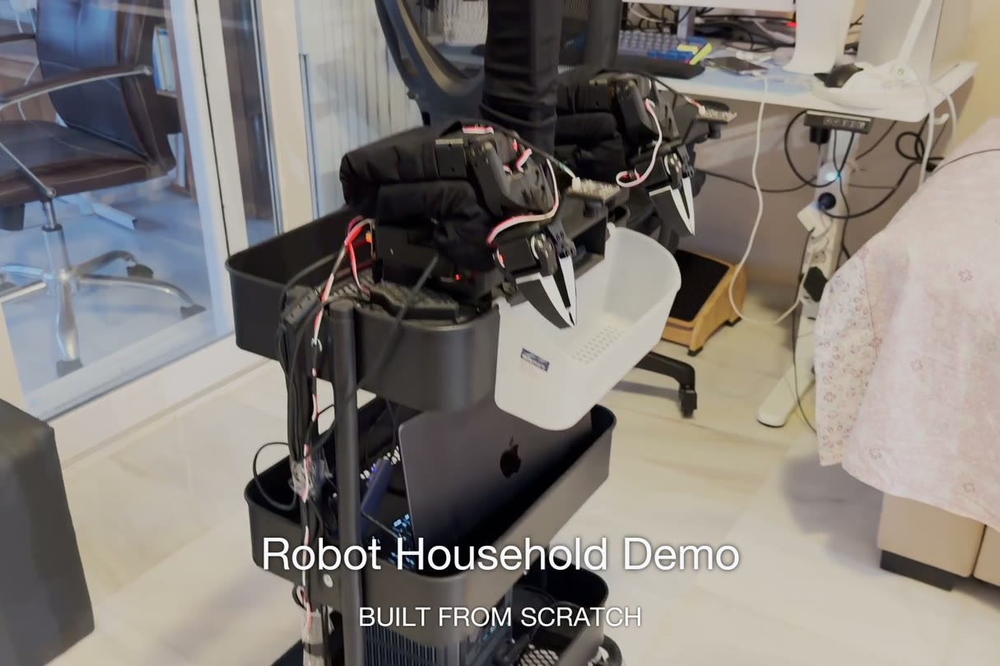
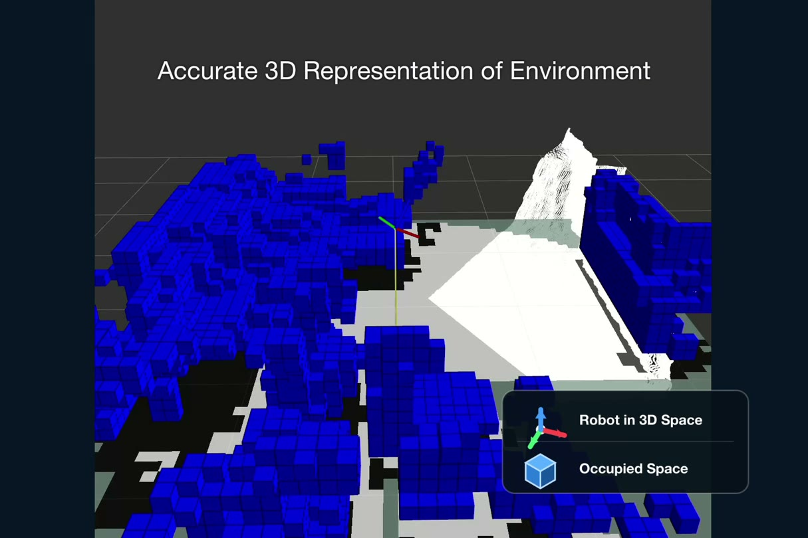
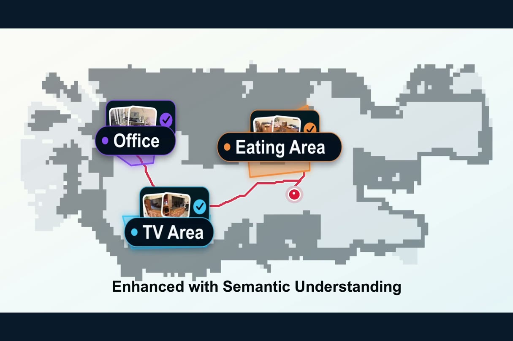
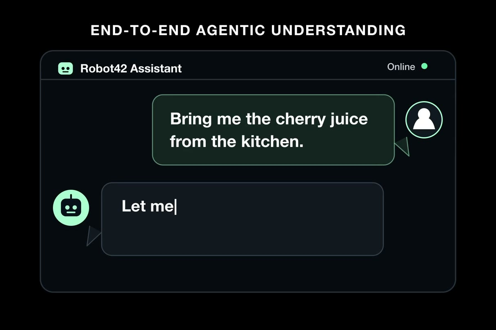
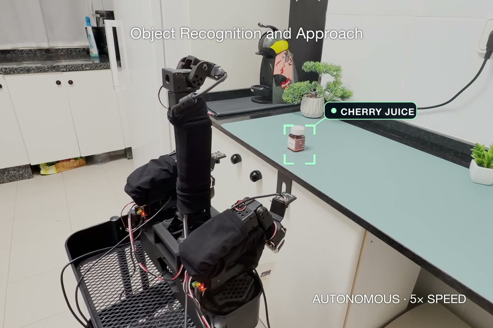
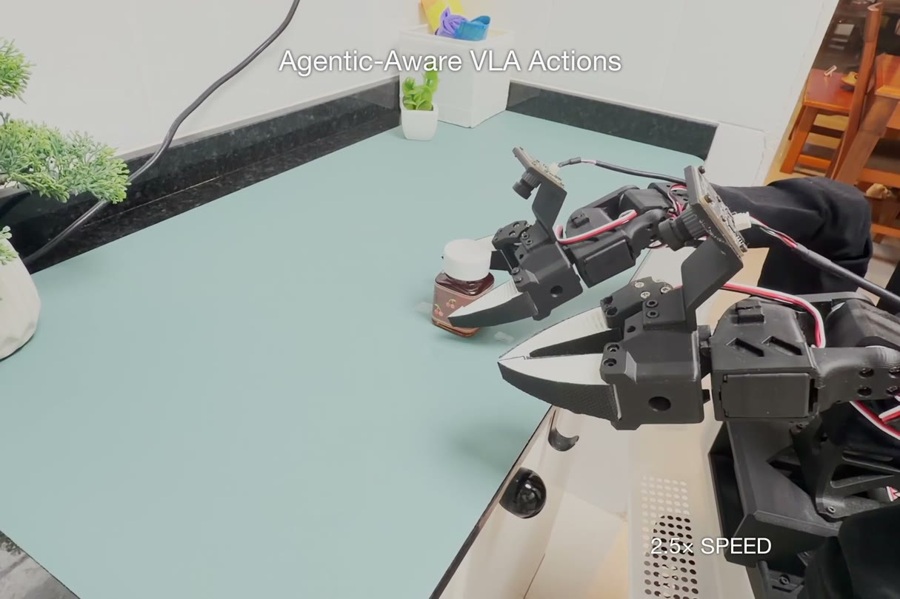
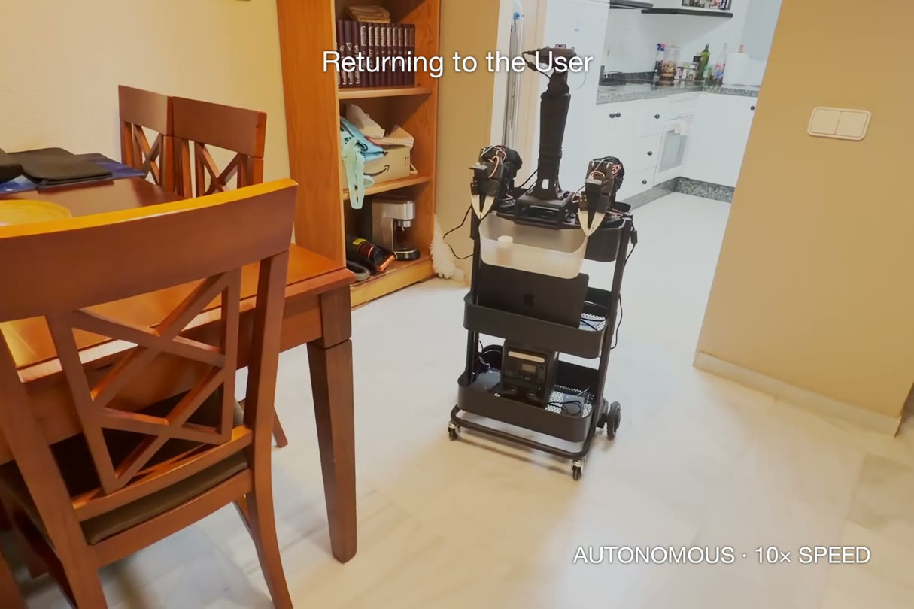
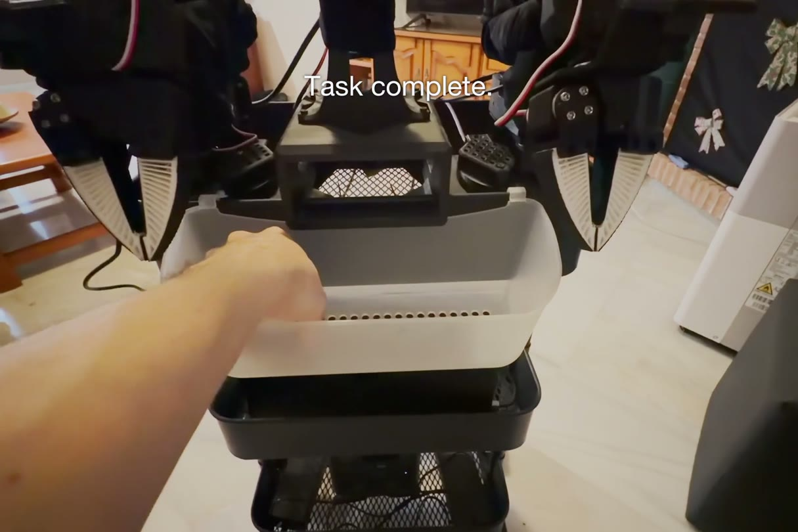

# Embodied Agents Platform

An open-source ROS 2 platform for embodied AI agents that perceive, remember, reason, navigate, and act in the physical world.

This repository is the software stack behind **Robot42**, a low-cost household robot built on XLeRobot. It combines RGB-D perception, ROS 2/Nav2, 3D and 2D mapping, semantic long-term memory, object recognition, LLM-driven task planning, and fine-tuned vision-language-action (VLA) policies.



## End-to-End Household Demo

The demonstrated task is deliberately simple to describe but crosses the whole stack:

> Bring me the small bottle of cherry juice from the kitchen.

Robot42 interprets the request, uses its saved understanding of the home to navigate to the kitchen, recognizes and approaches the bottle, runs a learned manipulation policy to place it in its basket, verifies the outcome, returns to its starting point, and presents the item to the user. The run is autonomous after the request; no teleoperation is used during task execution.

```text
user request
    -> reason over semantic home memory
    -> navigate to the kitchen with Nav2
    -> recognize, center, and approach the bottle
    -> execute the fine-tuned VLA manipulation skill
    -> detect release and visually verify the basket outcome
    -> return to the saved start pose for handoff
```

### 1. Perceive and Map the Home

The head-mounted RGB-D camera supplies color, depth, and point clouds. Robot42 can scan the environment, transform observations through ROS TF, construct a 3D occupancy representation, and project it into maps suitable for navigation.



### 2. Turn Maps Into Semantic Memory

An approved environment can be stored as long-term home memory rather than treated as a disposable map. Geometric regions are associated with labels, representative observations, navigable poses, and points of interest such as the kitchen, office, TV area, eating area, and 3D-printer area.



### 3. Reason About a User Request

The home agent translates a natural-language request into grounded robot tools. It resolves the named region, plans an object-search route, controls when local perception should refresh long-term knowledge, and sequences navigation, recognition, approach, manipulation, verification, and return.



### 4. Navigate, Recognize, and Approach

Nav2 handles global planning and local velocity control. Near the target region, RGB-D observations and object detection localize the requested item, estimate its geometry, center the robot, and make bounded final approach movements before manipulation begins.



### 5. Execute a Learned Manipulation Skill

The robot transitions through deterministic safe arm poses and launches an on-demand, right-arm SmolVLA policy fine-tuned from demonstrations. The runtime executes action chunks, enforces joint and gripper limits, detects the grasp-to-release sequence, captures right-wrist evidence, and stops the policy before it can repeat the task.



### 6. Verify, Return, and Hand Off

After release, a vision-capable verifier checks that the bottle is inside the basket. Only an approved outcome allows the arms to return to the navigation stow pose. Robot42 then navigates back to its saved starting point and reports that the item is ready for the user.

| Autonomous return | Item handoff |
| --- | --- |
|  |  |

## What It Does

- Runs a real robot through ROS 2, Nav2, `/cmd_vel`, odometry, RGB-D, point clouds, and occupancy maps.
- Builds maps from camera/head scans, fused scan data, point clouds, and OctoMap projected maps.
- Detects frontiers, previews candidate paths through Nav2, and chooses where to explore next.
- Supports both heuristic and LLM frontier selection.
- Provides a live web UI for exploration review, map editing, environment approval, and manual waypoint navigation.
- Saves approved environments as reusable memory for later agent tasks.
- Lets an agent reason over saved home memory and call grounded tools for navigation, relocalization, region scans, object detection, centering, approach, learned manipulation, verification, and return-to-start handoff.
- Runs SmolVLA and ACT checkpoints on the real XLeRobot, including right-arm-only policy contracts and live camera visualization.
- Starts the VLA worker on demand, detects task release, verifies that the object reached the basket, and gates the safe post-action stow sequence on that verification.
- Includes simulation and playground modes so exploration logic can be tested without the physical robot.
- Includes VR and keyboard teleoperation paths for data collection and direct control.

## System Shape

```text
User / Agent UI
      |
      v
Home agent + grounded tool registry
      |
      v
Semantic memory + exploration backend
      |
      v
ROS 2 / Nav2 / SLAM / OctoMap
      |
      v
real_ros_bridge -> robot brain -> motors, cameras, RGB-D, IMU
                                      |
                                      v
                         on-demand VLA manipulation
                                      |
                                      v
                         visual outcome verification
```

The real exploration loop is:

```text
scan -> update map -> detect frontiers -> preview Nav2 paths
     -> choose next goal -> navigate_to_pose -> repeat -> save environment memory
```

For real hardware runs, Nav2 performs path planning and local velocity control. The robot brain executes bounded velocity and camera commands on the XLeRobot.

## Capabilities

### Real-World Exploration

The real robot can perform an initial 360 degree camera-pan scan, build an occupancy representation, select frontiers, navigate to them with Nav2, and keep expanding the map. Use [end-to-end-exploration.md](end-to-end-exploration.md) for the concise exploration-only commands; [REAL_EXPLORATION_END_TO_END.md](REAL_EXPLORATION_END_TO_END.md) contains the detailed setup, alternatives, calibration, and troubleshooting notes.

### Navigation and Mapping

The platform includes ROS/Nav2 runtime code, generated Nav2 parameters, SLAM and OctoMap launch files, path previewing, relocalization hooks, RGB-D visual odometry, wheel odometry, scan fusion, point-cloud fusion, and diagnostics for odometry and rotation.

Important modules:

- [xlerobot_playground/real_agentic_exploration.py](xlerobot_playground/real_agentic_exploration.py)
- [xlerobot_playground/ros_nav2_runtime.py](xlerobot_playground/ros_nav2_runtime.py)
- [xlerobot_playground/real_ros_bridge.py](xlerobot_playground/real_ros_bridge.py)
- [xlerobot_playground/nav2_goal_client.py](xlerobot_playground/nav2_goal_client.py)
- [launch/xlerobot_octomap.launch.py](launch/xlerobot_octomap.launch.py)

### Agent Runtime

The agent layer turns saved environment memory into actionable robot tools. It can inspect known areas, preview or execute navigation, scan regions for an object, save what the robot saw, estimate object geometry from RGB-D, issue small approach movements, invoke a learned manipulation skill, verify the result, and return to the saved start pose.

Important modules:

- [xlerobot_agent/home_agent.py](xlerobot_agent/home_agent.py)
- [xlerobot_agent/tools.py](xlerobot_agent/tools.py)
- [xlerobot_agent/home_memory.py](xlerobot_agent/home_memory.py)
- [xlerobot_agent/object_detection.py](xlerobot_agent/object_detection.py)
- [examples/robot42_agent_backend.py](examples/robot42_agent_backend.py)

### Learned Manipulation

SmolVLA and ACT inference share a real-robot policy runner with LeRobot-compatible preprocessing and postprocessing. The integrated handoff path starts the model worker only when the agent requests manipulation, executes a right-arm-only policy while the robot brain retains hardware ownership, and returns structured completion states to the home agent.

The integrated safety and completion path includes:

- deterministic `NAV_STOW -> ACTION_READY` arm transitions;
- camera and checkpoint contract validation before actions are sent;
- bounded per-step joint and gripper deltas;
- grasp/release phase detection instead of relying only on a rollout timer;
- settled right-wrist evidence capture and vision-based basket verification;
- verification-gated return to `NAV_STOW`; and
- cancellation through the robot brain stop endpoint.

Important modules:

- [scripts/run_xlerobot_smolvla_policy.py](scripts/run_xlerobot_smolvla_policy.py)
- [scripts/run_xlerobot_act_policy.py](scripts/run_xlerobot_act_policy.py)
- [xlerobot_agent/vla_policy.py](xlerobot_agent/vla_policy.py)
- [xlerobot_agent/vla_worker.py](xlerobot_agent/vla_worker.py)
- [xlerobot_playground/vla_handoff_runtime.py](xlerobot_playground/vla_handoff_runtime.py)
- [xlerobot_agent/basket_verification.py](xlerobot_agent/basket_verification.py)

### Web UI

The React UI can connect to the agent backend and exploration backend. It supports saved environment loading, live navigation sessions, map interaction, and the "What Robot Saw" panel for object-search runs.

See [frontend/robot42/README.md](frontend/robot42/README.md).

### Simulation and Playgrounds

Simulation paths let you develop exploration logic with ManiSkill, synthetic backends, teleport movement, or ROS/Nav2 without needing every hardware component running.

Start with [RUNNING_EXPLORATION.md](RUNNING_EXPLORATION.md) and [SIMULATION_NAV2.md](SIMULATION_NAV2.md).

### Teleoperation and Data Collection

The repo includes keyboard and VR control paths for XLeRobot, named safe poses, session episode counters, and LeRobot dataset recording flows for collecting manipulation demonstrations. It also includes utilities for deriving right-arm datasets, auditing episodes, and inspecting release-aligned samples.

See [VR_TELEOPERATION.md](VR_TELEOPERATION.md) and [TELEOPERATION_TRAINING.md](TELEOPERATION_TRAINING.md).

## Quick Start

This project is currently a research/development stack, not a one-command package install. The exact command path depends on whether you are running simulation, ROS/Nav2, or the physical robot.

### Run the Agent UI

```bash
cd frontend/robot42
npm install
npm run dev
```

In another terminal, start the agent backend:

```bash
python examples/robot42_agent_backend.py \
  --memory-root ./artifacts/memories \
  --agent-artifacts-root ./artifacts/agent_runs
```

The backend defaults to mock mode. For a live model-backed agent, pass a provider and model, for example:

```bash
python examples/robot42_agent_backend.py \
  --memory-root ./artifacts/memories \
  --provider openai \
  --model gpt-5.5 \
  --exploration-backend-url http://127.0.0.1:8770 \
  --agent-artifacts-root ./artifacts/agent_runs
```

### Run Simulated Exploration

```bash
python examples/xlerobot_exploration_playground.py \
  --movement-mode simulated \
  --ui-flavor user \
  --explorer-policy heuristic
```

For LLM frontier decisions, use `--explorer-policy llm` and configure the provider/model flags documented in [RUNNING_EXPLORATION.md](RUNNING_EXPLORATION.md).

### Run Real Exploration

The real path expects the robot brain, Orbbec sidecar, real ROS bridge, odometry, Nav2, and mapping stack to be running. The full multi-terminal sequence is in [REAL_EXPLORATION_END_TO_END.md](REAL_EXPLORATION_END_TO_END.md).

The exploration runtime entrypoint is:

```bash
python -m xlerobot_playground.real_agentic_exploration \
  --memory-root ./artifacts/memories
```

### Run the End-to-End Fetch Task

The exact robot-Mac and offload-PC terminal sequence used for navigation, semantic memory, object search, VLA manipulation, basket verification, return, UI, and RViz observation is documented in [end-to-end-action-inference.md](end-to-end-action-inference.md).

This is a multi-process real-hardware workflow, so follow that runbook instead of starting individual services from abbreviated commands.

## Repository Layout

```text
xlerobot_agent/        Agent runtime, memory, tools, prompts, object detection
xlerobot_playground/   ROS/Nav2 runtimes, bridges, mapping, exploration, diagnostics
multido_xlerobot/      Integration facade for the local XLeRobot/LeRobot fork
examples/              Runnable backend, playground, bridge, and service entrypoints
frontend/robot42/      React UI for agent and exploration workflows
launch/                ROS 2 launch files for OctoMap/relocalization
config/                Mapping and OctoMap configuration
scripts/               Setup, rendering, capture, and diagnostic helpers
tests/                 Unit and integration tests for exploration, ROS, agent tools
plans/                 Design notes and implementation plans
```

## Useful Docs

- [REAL_EXPLORATION_END_TO_END.md](REAL_EXPLORATION_END_TO_END.md): real robot exploration runbook
- [RUNNING_EXPLORATION.md](RUNNING_EXPLORATION.md): simulation, ROS, and playground exploration commands
- [SMOKE_TEST_END_TO_END_EXPLORATION.md](SMOKE_TEST_END_TO_END_EXPLORATION.md): smoke-test workflow
- [SIMULATION_NAV2.md](SIMULATION_NAV2.md): ManiSkill + ROS/Nav2 notes
- [AGENT_RUNTIME.md](AGENT_RUNTIME.md): simplified agent runtime overview
- [end-to-end-action-inference.md](end-to-end-action-inference.md): complete real-hardware fetch and handoff workflow
- [INTEGRATION.md](INTEGRATION.md): XLeRobot fork integration boundary
- [ODOMETRY_TESTS.md](ODOMETRY_TESTS.md): odometry validation notes
- [command_reference/README.md](command_reference/README.md): command reference index

## Testing

Run the Python test suite with:

```bash
python -m unittest
```

Focused tests are useful while developing a specific subsystem:

```bash
python -m unittest tests.test_real_agentic_exploration
python -m unittest tests.test_exploration_backend
python -m unittest tests.test_home_agent
```

## Status

This is an active embodied-agent research stack. The demonstrated cherry-juice task runs on real hardware across ROS/Nav2 navigation, RGB-D perception, semantic memory, agent tool execution, object recognition and approach, SmolVLA manipulation, outcome verification, and return-to-start handoff.

It is not a production-certified robotics system. Generalization to new homes, objects, embodiments, and manipulation tasks remains experimental; behavior depends on the selected LLM/VLM provider, detector, checkpoint, calibration, and environment. Full production-grade safety validation is outside the current project scope.

Use conservative robot speed limits, keep a physical stop option available, and test new navigation behaviors in simulation or smoke-test mode before running them on hardware.

## License

Released under the [Apache License 2.0](LICENSE).
